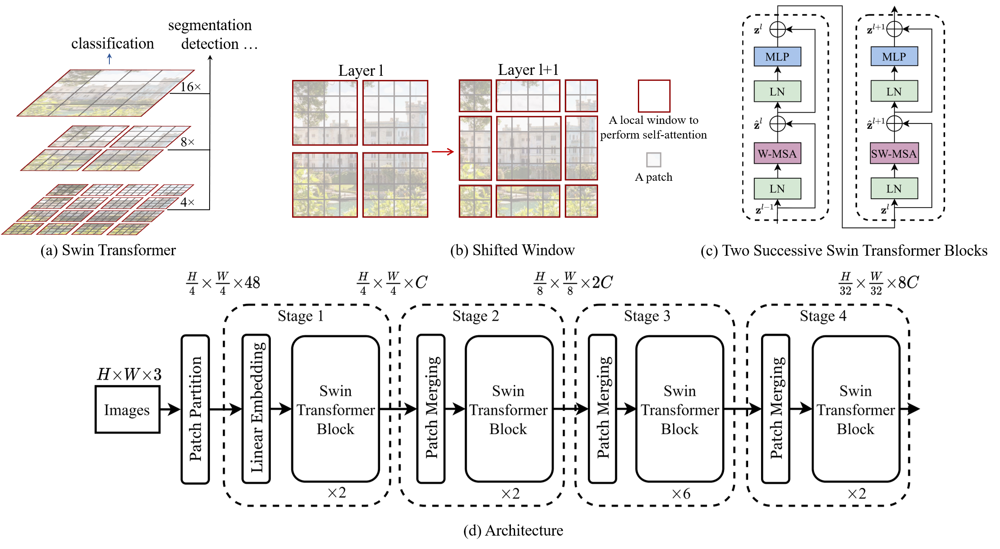

# Document Intelligence with DONUT: A Deep Dive into Document Understanding Transformer

In today's data-driven world, extracting structured information from documents remains a challenging yet crucial task. The Document Understanding Transformer (DONUT) model represents a significant advancement in this field, offering powerful capabilities for document analysis without requiring complex OCR preprocessing. In this post, we'll explore how DONUT can transform your document processing workflows through three key applications: document question answering, image classification, and structured information extraction.

## What is DONUT?


DONUT (Document Understanding Transformer) is an end-to-end model designed specifically for Visual Document Understanding (VDU) tasks. Unlike traditional approaches that rely on Optical Character Recognition (OCR) as a preprocessing step, DONUT directly processes document images to extract meaningful information, eliminating the OCR bottleneck entirely.

The model's name "DONUT" stands for "Document Understanding Transformer," highlighting its foundation in transformer architecture while performing document analysis tasks.

## Why We Need DONUT

Traditional document processing pipelines face several significant challenges:

1. **OCR Dependency**: Conventional systems require OCR to convert document images to text before analysis, introducing an error-prone intermediate step.

2. **Computational Overhead**: Running OCR engines, particularly on large document collections, demands substantial computational resources.

3. **Language and Format Limitations**: OCR systems often struggle with documents in different languages or non-standard formats, reducing their effectiveness.

4. **Error Propagation**: Mistakes made during OCR propagate through subsequent processing stages, compromising overall system reliability.

DONUT addresses these issues by offering an OCR-free approach that processes document images directly, resulting in:
- Reduced computational requirements
- Greater flexibility across languages and document types
- Elimination of error propagation from OCR systems
- Streamlined end-to-end document processing

## DONUT's Architecture

At the heart of **DONUT (Document Understanding Transformer)** lies a powerful encoder–decoder design that seamlessly connects visual document features with structured textual outputs.

### 1. Vision Encoder (Swin Transformer):



At the front of DONUT’s pipeline sits the Swin Transformer, a vision backbone designed to efficiently process high-resolution images like scanned documents and forms.

- Hierarchical Representation:
    - Unlike vanilla Vision Transformers that treat an image as a flat sequence of patches, the Swin Transformer builds multi-level features. This makes it better at understanding both fine-grained details (like characters or table borders) and larger structures (like paragraphs, sections, or figures).

- Shifted Windowing Mechanism:
    - Instead of attending to every patch globally (which is computationally expensive for large images), Swin uses shifted windows. This allows the model to capture local context (e.g., words inside a cell of a table) while still propagating information across windows to capture global context (e.g., the structure of the entire table).

- Document Layout Awareness:
    - Documents often mix text, graphics, stamps, tables, and logos. The encoder is designed to adaptively capture these diverse elements, ensuring that semantic meaning isn’t lost even in visually dense layouts.

In summary, the vision encoder transforms raw pixels into dense visual embeddings that carry both semantic and spatial context.


### 2. Text Decoder (BART):

Once the visual features are extracted, they’re passed into DONUT’s BART-based text decoder. Unlike conventional OCR that outputs words, the decoder directly generates structured text sequences.


- Bidirectional + Auto-Regressive:
    - BART combines the strengths of bidirectional encoding (understanding context in both directions, like BERT) with auto-regressive decoding (generating tokens step-by-step, like GPT). This makes it highly effective for producing long, coherent text sequences.

- From Visuals to Text:
    - The decoder conditions on the encoder’s visual embeddings, learning to translate visual patterns into natural language tokens. Instead of detecting words, it “reads” the meaning of the document holistically.

- Structured JSON Outputs:
    - One of DONUT’s standout features is its ability to generate outputs in JSON format. For example, an invoice can be directly converted into structured fields like { "Invoice Number": "...", "Date": "...", "Total": "..." }. This means DONUT’s results are immediately usable in downstream applications—no extra parsing required.

- Flexible Prompting:
    - Depending on the task (invoice parsing, receipt extraction, document classification, etc.), the decoder can be guided with different prompts. This flexibility allows the same model to adapt across multiple document understanding scenarios.

The result is a clean, efficient, and highly generalizable framework that bridges the gap between raw document images and machine-readable structured information.

In essence: DONUT rethinks document AI. It doesn’t “read” like a human with OCR—it interprets documents as a whole, mapping visuals directly into structured meaning.

## Code Walkthrough

### Part 1: Document Question Answering

**Setting Up the Environment**

First, we import the required libraries:

```python
# Import necessary libraries for document question answering
import torch
from datasets import load_dataset
from transformers import AutoProcessor, AutoModelForVision2Seq
```

Next, we load a DONUT model specifically fine-tuned for document visual question answering (DocVQA). The `AutoProcessor` handles both image preprocessing and text tokenization, while `AutoModelForVision2Seq` loads the pre-trained model architecture.

```python
# load model
processor = AutoProcessor.from_pretrained("naver-clova-ix/donut-base-finetuned-docvqa")
model = AutoModelForVision2Seq.from_pretrained("naver-clova-ix/donut-base-finetuned-docvqa")
```

**Loading a Sample Document**

Here, we load a sample document from the Hugging Face dataset repository and display it:

```python
# Load the dataset and display the first image
dataset = load_dataset("hf-internal-testing/example-documents", split="test")
image = dataset[0]["image"]
```


**Preparing the Input**

Next, we formulate a question about the document and prepare it for the model:

```python
# Define the question and task prompt, and process the image and prompt
question = "What is the time for questions and answers?"
task_prompt = f"<s_docvqa><s_question>{question}</s_question><s_answer>"

inputs = processor(images=image, text=task_prompt, return_tensors="pt")
print(inputs)
```

```
{'pixel_values': tensor([[[[-1., -1., -1.,  ..., -1., -1., -1.],
          [-1., -1., -1.,  ..., -1., -1., -1.],
          [-1., -1., -1.,  ..., -1., -1., -1.],
          ...,
          [-1., -1., -1.,  ..., -1., -1., -1.],
          [-1., -1., -1.,  ..., -1., -1., -1.],
          [-1., -1., -1.,  ..., -1., -1., -1.]],

         [[-1., -1., -1.,  ..., -1., -1., -1.],
          [-1., -1., -1.,  ..., -1., -1., -1.],
          [-1., -1., -1.,  ..., -1., -1., -1.],
          ...,
          [-1., -1., -1.,  ..., -1., -1., -1.],
          [-1., -1., -1.,  ..., -1., -1., -1.],
          [-1., -1., -1.,  ..., -1., -1., -1.]],

         [[-1., -1., -1.,  ..., -1., -1., -1.],
          [-1., -1., -1.,  ..., -1., -1., -1.],
          [-1., -1., -1.,  ..., -1., -1., -1.],
          ...,
          [-1., -1., -1.,  ..., -1., -1., -1.],
          [-1., -1., -1.,  ..., -1., -1., -1.],
          [-1., -1., -1.,  ..., -1., -1., -1.]]]]), 'labels': tensor([[57527, 57529, 42543, 52743, 48941, 16838, 57245, 17328,  8600, 37783,
         46192, 36209, 57524, 57526]]), 'input_ids': tensor([[57527, 57529, 42543, 52743, 48941, 16838, 57245, 17328,  8600, 37783,
         46192, 36209, 57524, 57526]])}
torch.Size([1, 3, 2560, 1920])
```


**Generating and Interpreting the Answer**

We use the model to generate an answer based on the document image and question:

```python
# Generate the output from the model
outputs = model.generate(
    input_ids=inputs.labels,
    pixel_values=inputs.pixel_values,
    max_length=512
)

# Decode the output sequence back into a human-readable string
answer = processor.decode(outputs[0], skip_special_tokens=True)
print(answer)
```
Output:

```
What is the time for questions and answers? 12:25 to 12:59 p.m.
```

The model successfully extracts the specific time information from the document, demonstrating DONUT's ability to understand document content and answer targeted questions without OCR.


### Part 2: Image Classification

**Setting Up for Document Classification**

We prepare the environment for document classification by loading a DONUT model fine-tuned on the RVL-CDIP dataset:

```python
# Import necessary libraries for image classification
import re
from transformers import DonutProcessor, VisionEncoderDecoderModel
from datasets import load_dataset
import torch

# Determine the device to use (GPU or CPU)
device = torch.device("cuda" if torch.cuda.is_available() else "cpu")

# Load the processor and model for image classification
processor = DonutProcessor.from_pretrained("naver-clova-ix/donut-base-finetuned-rvlcdip")
model = VisionEncoderDecoderModel.from_pretrained("naver-clova-ix/donut-base-finetuned-rvlcdip")

# Move the model to the selected device
model.to(device)
```


**Loading a Document for Classification**

Here we load and display a different document from the dataset that we'll classify.

```python
# Load a sample document image from the dataset for classification
image = dataset[1]["image"]
print(image)
```


**Preparing the Model Input**

Next, we prepare inputs for document classification:
    - Create a task-specific prompt using the special token for RVL-CDIP classification
    - Tokenize the prompt and extract the input IDs
    - Process the image to obtain pixel values in the specified format expected by the model

```python
# Prepare the decoder input for the model, specifying the task prompt for image classification
task_prompt = "<s_rvlcdip>"
decoder_input = processor.tokenizer(task_prompt, add_special_tokens=False, return_tensors="pt")

# Extract the input IDs from the prepared decoder input
decoder_input_ids = decoder_input.input_ids

# Process the image to obtain pixel values
pixel_values = processor(image, return_tensors="pt").pixel_values
```


**Generating and Processing Classification Results**

We generate a classification output using the model and process the result:


```python
# Generate the output sequence from the model based on the image and decoder input
outputs = model.generate(
    pixel_values.to(device),
    decoder_input_ids=decoder_input_ids.to(device),
    max_length=model.decoder.config.max_position_embeddings,
    pad_token_id=processor.tokenizer.pad_token_id,
    eos_token_id=processor.tokenizer.eos_token_id,
    use_cache=True,
    bad_words_ids=[[processor.tokenizer.unk_token_id]],
    return_dict_in_generate=True,
)

# Decode the generated sequence back into a human-readable string
sequence = processor.batch_decode(outputs.sequences)[0]
```

```
<s_rvlcdip><s_class><advertisement/></s_class></s>
```

**Extracting the Classification Result**

Next, we process the raw output by removing special tokens from the sequence and converting the sequence to a structured JSON format.

```python
# Clean up the decoded sequence and convert to a structured format
sequence = sequence.replace(processor.tokenizer.eos_token, "").replace(processor.tokenizer.pad_token, "")
sequence = re.sub(r"<.*?>", "", sequence, count=1).strip()
print(processor.token2json(sequence))
```


```
{'class': 'advertisement'}
```

The result shows the document is correctly classified as an "advertisement", demonstrating DONUT's ability to categorize documents without requiring OCR preprocessing.


### Part 3: Document Parsing

**Setting Up for Document Parsing**

We prepare for document parsing by loading a DONUT model fine-tuned on the CORD dataset, specialized for parsing receipts:

```python
# Import necessary libraries for document parsing
import re
from transformers import DonutProcessor, VisionEncoderDecoderModel
from datasets import load_dataset
import torch

# Load the processor and model for document parsing (fine-tuned on CORD dataset)
processor = DonutProcessor.from_pretrained("naver-clova-ix/donut-base-finetuned-cord-v2")
model = VisionEncoderDecoderModel.from_pretrained("naver-clova-ix/donut-base-finetuned-cord-v2")

# Move the model to the selected device
model.to(device)
```

**Loading and Preparing a Document for Parsing**

We load a receipt image and prepare it for parsing:

```python
# Load a sample document image from the dataset for parsing
image = dataset[2]["image"]
```


```python
# Prepare the decoder input for the model, specifying the task prompt for document parsing
task_prompt = "<s_cord-v2>"
decoder_input = processor.tokenizer(task_prompt, add_special_tokens=False, return_tensors="pt")

# Process the image to obtain pixel values suitable for the model
pixel_values = processor(image, return_tensors="pt").pixel_values
```


**Generating and Processing Parsing Results**

We generate structured output from the receipt image and convert it to a JSON format:

```python
# Generate the output sequence from the model based on the image and decoder input
outputs = model.generate(
    pixel_values.to(device),
    decoder_input_ids=decoder_input_ids.to(device),
    max_length=model.decoder.config.max_position_embeddings,
    pad_token_id=processor.tokenizer.pad_token_id,
    eos_token_id=processor.tokenizer.eos_token_id,
    use_cache=True,
    bad_words_ids=[[processor.tokenizer.unk_token_id]],
    return_dict_in_generate=True,
)

# Decode and clean up the generated sequence
sequence = processor.batch_decode(outputs.sequences)[0]
sequence = sequence.replace(processor.tokenizer.eos_token, "").replace(processor.tokenizer.pad_token, "")
sequence = re.sub(r"<.*?>", "", sequence, count=1).strip()
```

```
<s_menu><s_nm> CINNAMON SUGAR</s_nm><s_unitprice> 17,000</s_unitprice><s_cnt> 1 x</s_cnt><s_price> 17,000</s_price></s_menu><s_sub_total><s_subtotal_price> 17,000</s_subtotal_price></s_sub_total><s_total><s_total_price> 17,000</s_total_price><s_cashprice> 20,000</s_cashprice><s_changeprice> 3,000</s_changeprice></s_total>
```

**Extracting Structured Information**

Next, the below code snippet converts the model output into a structured JSON format containing detailed information from the receipt:
```python
# Convert the cleaned sequence into a structured JSON format
print(processor.token2json(sequence))
```

```json
{
  "menu": {
    "nm": "CINNAMON SUGAR",
    "unitprice": "17,000",
    "cnt": "1 x",
    "price": "17,000"
  },
  "sub_total": {
    "subtotal_price": "17,000"
  },
  "total": {
    "total_price": "17,000",
    "cashprice": "20,000",
    "changeprice": "3,000"
  }
}
```
The model successfully extracts detailed structured data from the receipt, including menu items, prices, and payment details. This demonstrates DONUT's ability to convert visual document content directly into machine-readable formats without OCR.

## Final Notes

This workflow demonstrates DONUT's capability across three document understanding tasks:

1. **Document Question Answering**: Extracting specific information in response to natural language questions
2. **Document Classification**: Automatically categorizing documents by type
3. **Document Parsing**: Converting visual document content into structured data formats

By utilizing the Swin Transformer for visual encoding and BART for text decoding, DONUT provides an end-to-end solution that eliminates the need for OCR preprocessing. This approach offers significant advantages in terms of efficiency, accuracy, and flexibility across different document types and languages.
