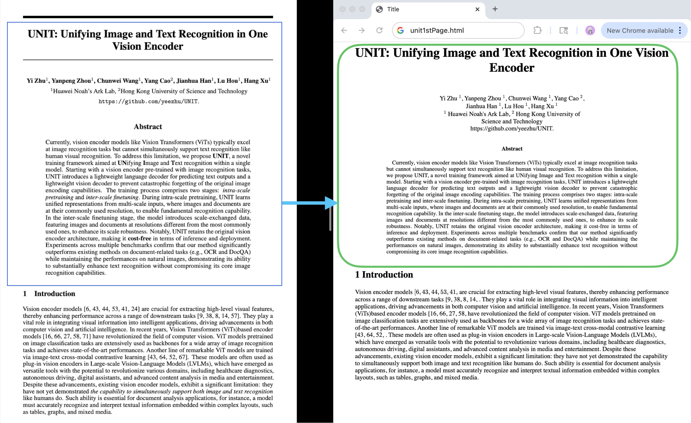
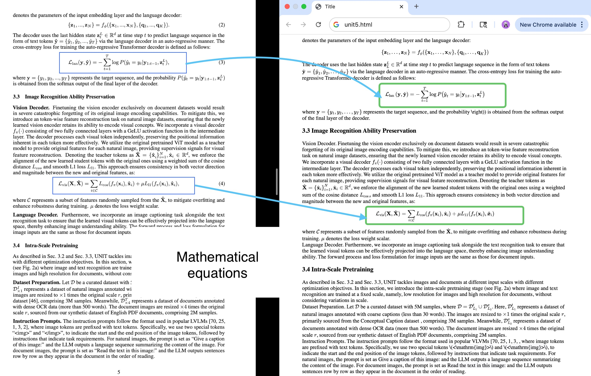
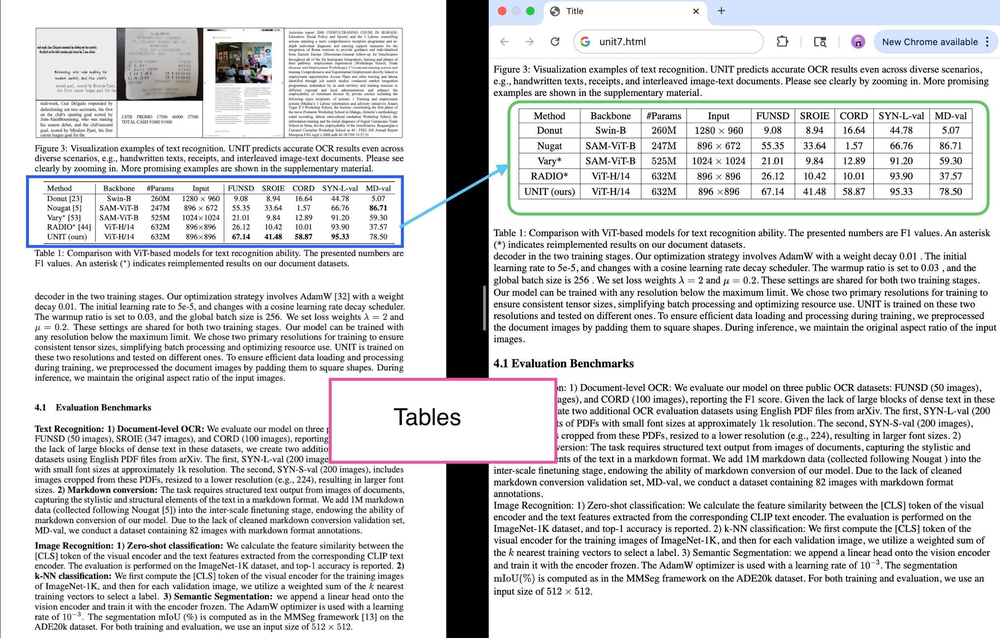

We have seen both pipeline-based and OCR-based methods for document understanding. In our exploration of document parsing models, we first experimented with PaperMage, DONUT, and Nougat before moving to GOT. Each offered unique approaches to document understanding, but GOT provides the most comprehensive solution with its end-to-end architecture.

# Overview

Traditional OCR (call it OCR-1.0) is a multi-step pipeline: detect text regions, crop them, run a recognizer, stitch results. That works, but it’s brittle and hard to extend to other “characters” like math, tables, sheet music, chemical SMILES, or charts.

The paper proposes **OCR-2.0** and introduces **GOT** (General OCR Theory model) — a single end-to-end encoder-decoder model that learns to read many kinds of optical signals directly from images. GOT is intentionally compact (about **580M parameters** total) and is built from:

* a **high-compression vision encoder** (≈80M params) that turns a high-res image into a stream of image tokens, and
* a **long-context language decoder** (≈0.5B params) that converts those tokens into text or formatted outputs (Markdown/LaTeX/TikZ/SMILES/Kern, etc.). 

The authors emphasize three training steps (pretrain encoder → joint train encoder+decoder → post-train decoder) and a set of synthetic data engines that make the model general and practical. 


# Stage 1 — Pretraining the vision encoder

**Goal:** teach the encoder to compress visual pages / slices into tokens that capture text and other visual symbols reliably.

**Design:**

* They pick **VitDet (base)** as the encoder (local attention helps with high-res images). The encoder is ~80M parameters.
* Inputs are resized to `1024×1024`, then the encoder compresses that into image tokens of size `256 × 1024`. These tokens are then projected into the language model embedding space. 

**Data for encoder pretraining:**

* About **5 million** image–text pairs total:

  * **3M** from scene text images (English + Chinese) — pseudo-labeled with tools like PaddleOCR.
  * **2M** from document images (PDF style) — text extracted from Common Crawl PDF files, plus many crop/slice examples so encoder sees both full pages and small text regions. 

**Pretraining:**

* To save compute and let the encoder learn quickly, they attach a **small decoder** (OPT-125M) during pretraining so gradients flow to the encoder, but they keep the focus on learning visual representations for OCR tasks. They train with AdamW, batch sizes and schedules that favor fast encoder learning. 

**Why this matters:** the encoder becomes a compact, general visual front end that works for both scene text and document text, and produces a token stream the decoder can work with efficiently.


# Stage 2 — Joint-training the encoder and decoder

Teach the combined system to turn the encoder’s visual tokens into correct, readable text — and to support many output styles.

* Replace the tiny decoder used in stage 1 with a **larger language decoder** (the authors use **Qwen-0.5B**). This decoder has much more capacity to generate long, formatted outputs. 
* Joint-train the encoder+decoder on **multi-task OCR data** that includes not just plain text, but also **math formulas, tables, charts, sheet music, SMILES (chemical strings), and geometric shapes**. They also include multi-page examples so the decoder learns long-context outputs.

**Training notes (simple numbers):**

* In joint training they increase the maximum token length (allowing longer outputs) and train with similar optimizer settings as stage 1. The paper says they push the max token length higher (e.g., to **6000** tokens during joint training) to support long outputs. 

The decoder learns how to read compressed visual information and emit either plain text or formatted representations (for example LaTeX for math, Markdown for tables, KERN for music notation). Because training is multi-task, a single GOT model can handle many OCR needs.


# Stage 3 — Post-training for enhanced features

**Goal:** add practical features users expect — region-level recognition, multi-page handling, and very large images — by tuning only the decoder (fast & cheap).


* **Only the decoder is post-trained.** The encoder stays as the compact perceptual front end; the decoder is fine-tuned with targeted synthetic data for new capabilities. 
* Adds **fine-grained / interactive OCR**: the user can supply a box (coordinates) or a color hint in the prompt and ask the model to read *only that region*. The model learned this via synthetic region / box data so it won’t output unrelated content. 
* Adds **dynamic resolution**: for ultra-high-res images (e.g., >2K) they use a dynamic multi-crop strategy so details aren’t lost.
* Adds **multi-page / batched PDF OCR**: the decoder’s token limit is expanded (the paper reports expanding up to `8192` tokens in post-training) so it can handle multi-page documents and long outputs. 

**Why this matters:** by only post-training the decoder with targeted synthetic data, the authors add features without re-training the whole huge model. That keeps iteration and deployment costs lower.


# Examples

GOT-OCR 2.0 provides powerful document understanding. Here are some examples of how to use it:

## Basic Usage

```python
from PIL import Image
from transformers import AutoModel, AutoTokenizer

# Load model and tokenizer
tokenizer = AutoTokenizer.from_pretrained('ucaslcl/GOT-OCR2_0', trust_remote_code=True)
model = AutoModel.from_pretrained('ucaslcl/GOT-OCR2_0', trust_remote_code=True, 
                                 low_cpu_mem_usage=True, device_map='cuda', 
                                 use_safetensors=True, 
                                 pad_token_id=tokenizer.eos_token_id)
model = model.eval().cuda()

# Process an image file
image_path = 'path/to/your/document.png'

# Extract plain text
plain_text = model.chat(tokenizer, image_path, ocr_type='ocr')

# Extract formatted text (preserves layout, math formulas, etc.)
formatted_text = model.chat(tokenizer, image_path, ocr_type='format')
```

## Advanced Features

### Rendered HTML Output

GOT can render complex documents (with math, tables, etc.) directly to HTML:







### Multi-crop Processing for High-Resolution Images

For very large or high-resolution documents, use the multi-crop feature:


## Final Notes

**GOT-OCR 2.0** represents a significant advancement in document understanding technology. Unlike traditional OCR systems that require multiple processing steps, GOT offers:

* **Single-pass processing** for any document type
* **Format preservation** for complex elements like math, tables, and diagrams
* **Flexible output formats** including plain text, LaTeX, Markdown, and HTML
* **High accuracy** even on challenging documents with mixed content
* **Efficient processing** with a relatively small model (580M parameters)

The examples above demonstrate how GOT can be easily integrated into document processing workflows, providing **good results** compared to traditional OCR pipelines and even other end-to-end models we tested like **PaperMage, DONUT, and Nougat**.


